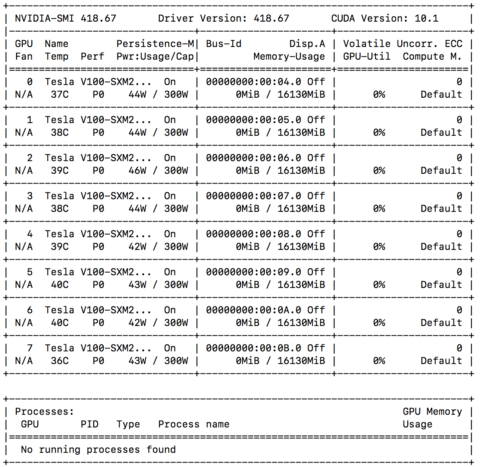

# multi_gpu_test
Parallelization with PyTorch on multi GPU machines _(tested on Google Cloud GPU machines)_ 
This is an assortment of utilities/scripts 
 * Pytorch installation steps/scripts 
 * Test utility to check multi gpu execution

# Install steps
_After procuring a GPU machine (see https://medium.com/@ajitrajasekharan/setting-up-a-machine-with-gpu-s-in-google-cloud-step-by-step-instructions-c6aa1086d8f9 for instructions)_
* Run first.sh - _this will install basic utilities for next steps_
* Run second.sh - _Follow instructions in displayed link  to get drivers for Nvidia. Install for Ubuntu 16.04 is provided in this repository (in second.sh - commented by default)_
* Confirm proper installation using _nvidia_smi_

* Run third.sh - _this will install anaconda, pytorch._

# Perform multi-gpu test
* conda activate bert
* python multi_gpu.py

_note the batch of 30 inputs is spread across 8 GPUs - 7 GPUs get 4 inputs and the last gets 2 (7*4 + 2 = 30)._

# Attribution
 The multigpu test (multi_gpu.py)  is a near verbatim extraction from the PyTorch tutorial https://pytorch.org/tutorials/beginner/blitz/data_parallel_tutorial.html 
 

# License

MIT License
